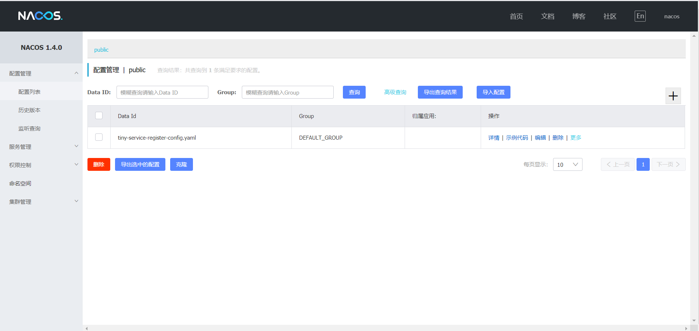
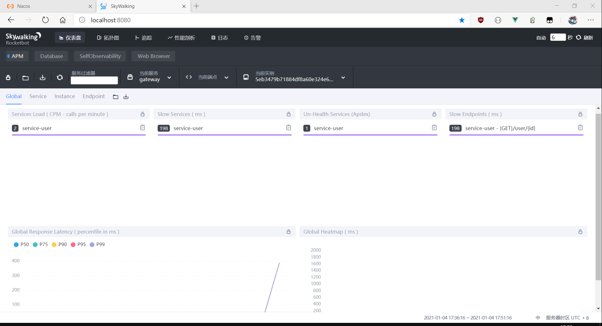
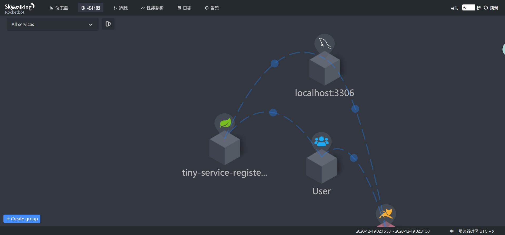

## 介绍

`Spring-cloud-alibaba-template` 是一套微服务脚手架，采用了 `Spring Cloud Hoxton` & `Alibaba` 、`Spring Boot 2.3` 、`Oauth2` 、`MyBatis`
、`Docker`、`Elasticsearch` 等核心技术， 同时提供了基于 `Vue` 的管理后台方便快速搭建系统。`template` 在通用业务的基础集成了注册中心、配置中心、监控中心、网关等系统功能。

## 组织结构

- ~~template-dependencies~~：统一的依赖管理
- `template-commons`：通用的工具类库
- `template-commons-domain`：通用的领域模型
- `template-commons-mapper`：通用的数据访问
- `template-commons-service`：通用的业务逻辑
- `template-generator`：通用的代码生成
- `template-external-skywalking`：外部的链路追踪
- `template-gateway`：路由网关统一访问接口
- `template-search`：Elasticsearch全文检索

## 服务规划

|服务|端口|说明|
|---|---|---|
|template-gateway       |9000|路由网关统一访问接口|
|template-search        |9502|全文检索|
|template-service-user  |9501|用户相关服务|
|···|···|···|

## 项目演示

[template-demo](http://47.105.186.18)

## 技术选型

### 后端技术

|技术        | 说明          |官网|
|---|---|---|
|Spring Cloud|    微服务框架    |https://spring.io/projects/spring-cloud|
|Spring Cloud Alibaba|    微服务框架    |https://github.com/alibaba/spring-cloud-alibaba|
|Spring Boot    |容器+MVC框架    |https://spring.io/projects/spring-boot|
|Spring Security |Oauth2    |认证和授权框架    https://spring.io/projects/spring-security-oauth|
|MyBatis    |ORM框架    |http://www.mybatis.org/mybatis-3/zh/index.html|
|MyBatisGenerator|	|数据层代码生成    http://www.mybatis.org/generator/index.html|
|PageHelper    |MyBatis物理分页插件    |http://git.oschina.net/free/Mybatis_PageHelper|
|Knife4j    |文档生产工具    |https://github.com/xiaoymin/swagger-bootstrap-ui|
|Elasticsearch|    搜索引擎    |https://github.com/elastic/elasticsearch|
|RabbitMq    |消息队列    |https://www.rabbitmq.com/|
|Redis    |分布式缓存    |https://redis.io/|
|MongoDb|    NoSql数据库    |https://www.mongodb.com/|
|Docker    |应用容器引擎    |https://www.docker.com/|
|Druid    |数据库连接池    |https://github.com/alibaba/druid|
|OSS    |对象存储    |https://github.com/aliyun/aliyun-oss-java-sdk|
|MinIO    |对象存储    |https://github.com/minio/minio|
|JWT    |JWT登录支持    |https://github.com/jwtk/jjwt|
|LogStash    |日志收集    |https://github.com/logstash/logstash-logback-encoder|
|Lombok    |简化对象封装工具    |https://github.com/rzwitserloot/lombok|
|Seata    |全局事务管理框架    |https://github.com/seata/seata|
|Portainer    |可视化Docker容器管理    |https://github.com/portainer/portainer|
|Jenkins    |自动化部署工具    |https://github.com/jenkinsci/jenkins|

### 前端技术

|技术|说明|官网|
|---|---|---|
|Vue        |前端框架              |https://vuejs.org/|
|Vue-router |路由框架             |https://router.vuejs.org/|
|Vuex       |全局状态管理框架         |https://vuex.vuejs.org/|
|Element    |前端UI框架             |https://element.eleme.io/|
|Axios      |前端HTTP框架         |https://github.com/axios/axios|
|v-charts   |基于Echarts的图表框架 |https://v-charts.js.org/|

## 预览

- Nacos：

  

- Skywalking:

  

  

