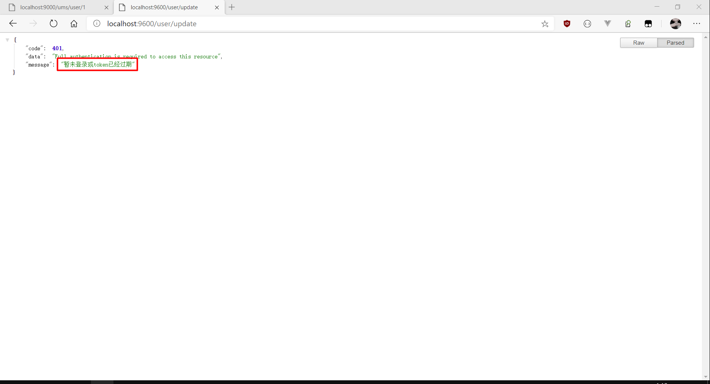
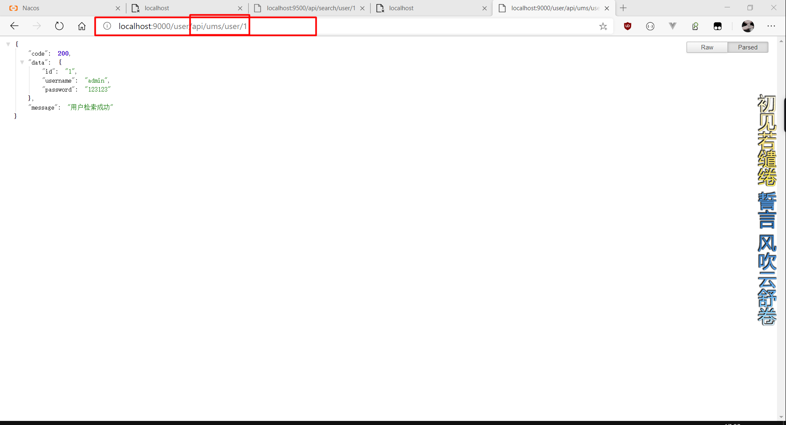
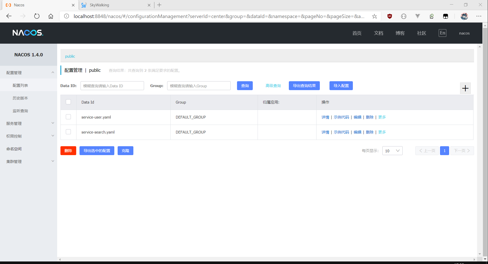
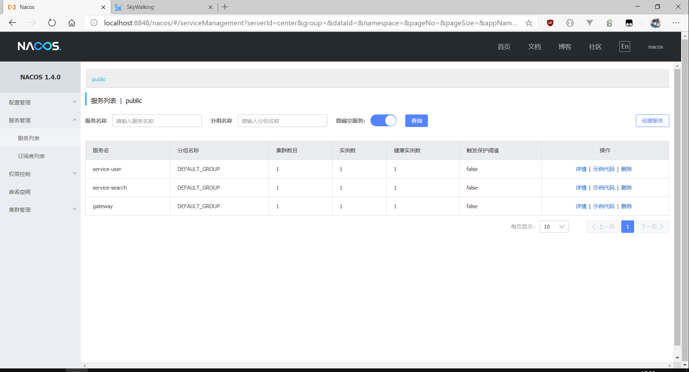
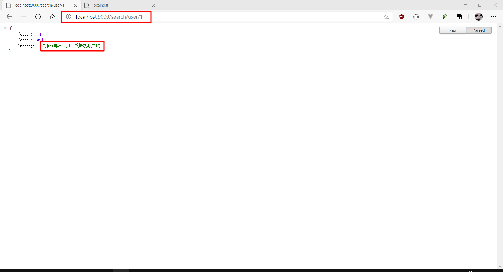
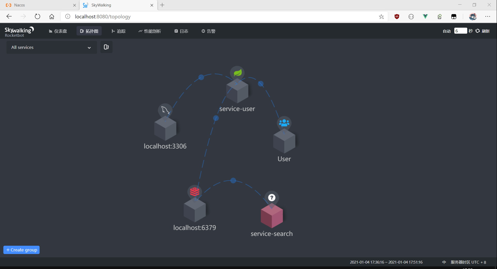
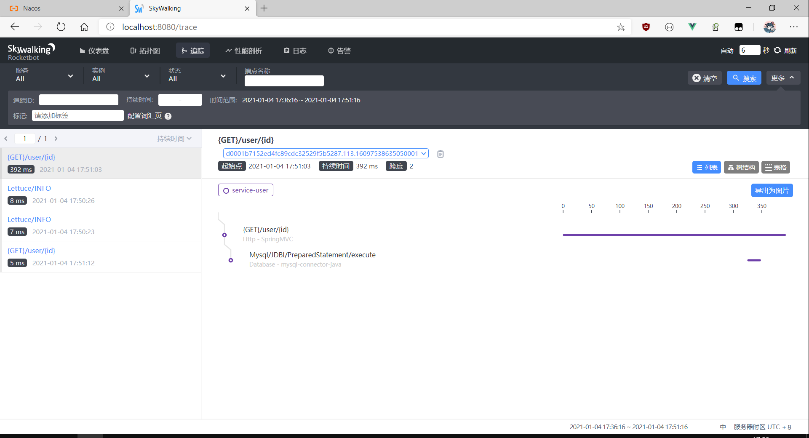
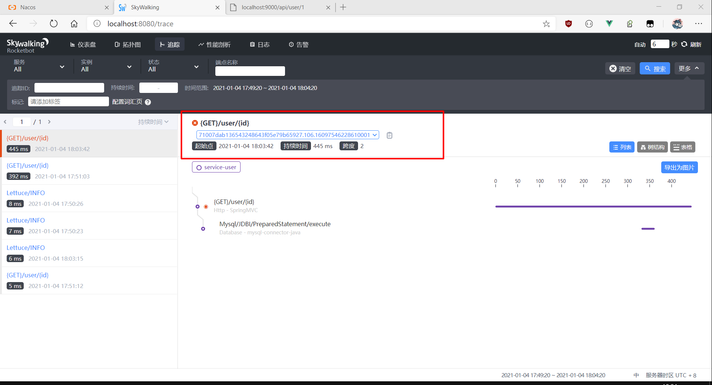

## 介绍

`Spring-cloud-alibaba-template` 是一套微服务脚手架，采用了 `Spring Cloud Hoxton` & `Spring Cloud Alibaba` 
、`Spring Boot 2.3.5.RELEASE` 、`MyBatis`
、`Elasticsearch` 等核心技术， 同时提供了基于 `Vue` 的管理后台方便快速搭建系统。
在通用业务的基础集成了注册中心、配置中心、监控中心、网关等系统功能。

> NOTE：
> 1. 项目使用`Spring Cloud Hoxton.SR9`版本 
> 2. 官方支持`SpringBoot 2.3.5.RELEASE`
> 3. 文档持续完善中

## 技术组件

## 组织结构

- ~~tiny-dependencies~~：统一的依赖管理模块
- `tiny-commons`：通用的工具类库模块
- `tiny-commons-entity`：通用的领域模型模块
- `tiny-commons-mapper`：通用的数据访问模块
- `tiny-commons-service`：通用的业务逻辑模块
- `tiny-security`：授权与认证模块
- `tiny-mbg`：通用的代码生成
- `tiny-skywalking`：外部的链路追踪
- `tiny-gateway`：路由网关统一访问接口
- `tiny-service-search`：全文检索模块
- `tiny-service-user`：用户服务模块

## 服务规划

|服务模块|端口|说明|
|---|---|---|
|tiny-gateway       |9000|路由网关统一访问接口|
|tiny-service-search|9500|全文检索模块|
|tiny-service-user  |9600|用户服务模块|
|···|···|···|

## 项目演示

[tiny-demo](http://47.105.186.18)

## 技术选型

### 后端技术

|技术        | 说明          |官网|
|---|---|---|
|Spring Cloud|    Spring官方提供的微服务解决方案    |https://spring.io/projects/spring-cloud|
|Spring Cloud Alibaba|    Alibaba提供的微服务框架    |https://github.com/alibaba/spring-cloud-alibaba|
|Spring Boot    | 全新容器+MVC框架    |https://spring.io/projects/spring-boot|
|Spring Security|认证和授权框架|https://spring.io/projects/spring-security-oauth|
|JWT|JWT授权框架|https://github.com/jwtk/jjwt|
|Mysql|Sql数据库|https://www.mysql.com/|
|Redis|分布式缓存|https://redis.io/|
|MyBatis    |ORM框架|http://www.mybatis.org/mybatis-3/zh/index.html|
|MyBatis-Plus|Mybatis增强工具|https://mp.baomidou.com/|
|MyBatis-Plus Generator|Mybatis代码生成器|https://mp.baomidou.com/guide/generator.html|
|Elasticsearch|  搜索引擎    |https://github.com/elastic/elasticsearch|
|~~RabbitMq~~ |消息队列|https://www.rabbitmq.com/|
|~~Druid~~ --> HikariCP |高性能的 JDBC 连接池组件|https://github.com/brettwooldridge/HikariCP|
|~~OSS~~    |对象存储    |https://github.com/aliyun/aliyun-oss-java-sdk|
|~~MinIO~~|对象存储    |https://github.com/minio/minio|
|Lombok|简化对象封装工具    |https://github.com/rzwitserloot/lombok|
|Seata|全局事务管理框架    |https://github.com/seata/seata|
|~~Portainer~~    |可视化Docker容器管理    |https://github.com/portainer/portainer|
|Jenkins|持续集成(CI)工具|https://github.com/jenkinsci/jenkins|
|Knife4j|文档生产工具|https://gitee.com/xiaoym/knife4j|
|……|……|……|

### 前端技术

|技术|说明|官网|
|---|---|---|
|Vue        |前端框架              |https://vuejs.org/|
|Vue-router |路由框架             |https://router.vuejs.org/|
|Vuex       |全局状态管理框架         |https://vuex.vuejs.org/|
|Element    |前端UI框架             |https://element.eleme.io/|
|Axios      |前端HTTP框架         |https://github.com/axios/axios|
|v-charts   |基于Echarts的图表框架 |https://v-charts.js.org/|

## 预览

- `SpringSecurity`授权认证中心
  

- `Spring-Cloud-Gateway` `API`网关
  

- `Nacos`服务注册发现：

  - `Nacos-Config`动态配置
  

  - `Nacos-Discovery`服务注册
  
    

- `Sentinel`熔断机制
  
  >开启Sentinel支持feign:`feign.sentinel.enabled=true`

  - 关闭被调用服务，服务访问失败
  
  - 再次访问，服务访问失败，`Sentinel`生效
  

- `Skywalking`链路追踪:
  > 自行配置探针
  - 仪表盘
  

  - 拓扑图
  
  
  - 追踪
  
    
  - 错误
  

